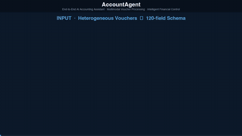

<h1 align="center">AccountAgent</h1>
<p align="center">
  <em>An End-to-End AI Accounting Assistant System with Multimodal Voucher Processing and Intelligent Financial Control</em>
</p>
<p align="center">
  <a href="LICENSE"></a>
  <a href="https://creativecommons.org/licenses/by/4.0/"></a>
  
  <a href="paper/AccountAgent.pdf"></a>
  
  
  
</p>

> **AccountAgent** is an end-to-end AI accounting assistant that couples a multimodal large
> language model with deterministic financial engines. A vision–language model recognizes
> more than thirty receipt types, a knowledge-base matcher maps them onto the chart of
> accounts, hard double-entry validation guarantees balanced vouchers, an event-driven
> integration bus posts business events into the ledger in real time, and a tax-compliance
> kernel plus a 30-day fund forecaster close the loop — shifting accounting from a
> bookkeeping orientation toward a management orientation.

This repository accompanies the manuscript
*"AccountAgent: An End-to-End AI Accounting Assistant System with Multimodal Voucher
Processing and Intelligent Financial Control"* and provides the compiled manuscript, the headline
results, and a runnable reference implementation for the five-layer AccountAgent system.

<p align="center">
  
</p>

<p align="center">
  <sub>10-second system walkthrough (loops inline) — watch one accounting cycle run end to end: heterogeneous vouchers (VAT invoice · bank statement · expense report · sales order) are recognized by the multimodal model and mapped onto the 44-subject chart of accounts; the event bus posts balanced entries into the ledger; alert rules, the tax kernel, and the 30-day fund forecaster each take their turn — and the loop closes with a posted voucher, live alerts, and a health-scored fund report. No staging, no manual re-entry: what the demo shows is what <code>python src/pipeline.py</code> runs. (<a href="assets/AccountAgent_demo.mp4">Open the MP4</a>)</sub>
</p>

---

## Highlights

| Dimension | Metric | Result |
|---|---|---|
| Voucher recognition | Field accuracy, 30+ receipt types | **>99%** |
| Voucher processing | Monthly post-approval error rate | **<0.3%** |
| Business–finance integration | Monthly closing time | **days → 1 day** |
| Fund management | Forecast horizon / warning trigger | **30 days / score < 70** |

| | Layer | Function |
|---|---|---|
| **1** | <small>**Intelligent Voucher Full-Pipeline Processing**</small> | <small>Multimodal recognizer (30+ receipt types) · knowledge-base subject matcher · hard double-entry validator</small> |
| **2** | <small>**Business–Finance Integrated Data Coordination**</small> | <small>Event-driven integration bus · AR / AP posting · cross-period closing</small> |
| **3** | <small>**Multidimensional Data Analysis and Warning**</small> | <small>Rule engine · OLS trend detection · 2σ anomaly flagging · dashboard</small> |
| **4** | <small>**Full-Pipeline Tax-Compliance Management**</small> | <small>VAT / income tax / stamp-duty computation · deadline calendar · declaration packets</small> |
| **5** | <small>**Intelligent Fund Management and Forecasting**</small> | <small>30-day OLS cash forecast · health-score gating · advisory on liquidity gaps</small> |

The five layers form a closed accounting loop rather than a linear chain: recognized vouchers
drive business–finance integration; integration surfaces the anomalies that analysis flags;
the analysis conditions the tax-compliance checks; and the fund forecast's gaps redirect
attention to the modules that can close them. See [`docs/architecture.md`](docs/architecture.md)
for a textual summary; the `src/` package mirrors this layering one-to-one.

## Key design: model where recognition is needed, compute deterministically elsewhere

An LLM asked to *compute* tax payable may hallucinate a plausible but wrong figure; a
bookkeeping voucher whose debits and credits do not balance is structurally invalid.
AccountAgent resolves this architecturally:

- the multimodal model (14×14-patch ViT encoder · 24 blocks · 2-layer MLP projector · decoder LLM) handles **perception** — reading documents — and **interpretation** — matching free-text descriptions to accounting subjects;
- every numerical result — balanced entries (|Σdebit − Σcredit| < 0.01), VAT/income-tax/stamp-duty computation, OLS forecasts, health scores — is produced by an **auditable deterministic engine**, traceable to its source.

## Repository structure

```
AccountAgent/
├── paper/                      # compiled manuscript (PDF)
│   ├── AccountAgent.pdf
│   └── LICENSE-paper.md        # CC-BY-4.0
├── src/                        # runnable five-layer implementation (stdlib only)
│   ├── voucher/                # Layer 1 — OCR engine, subject matcher, voucher manager
│   ├── integration/            # Layer 2 — event bus, AR/AP posting, closing
│   ├── analytics/              # Layer 3 — rules, OLS trends, 2σ anomalies, dashboard
│   ├── tax/                    # Layer 4 — VAT / income tax / stamp duty, deadlines
│   ├── fund/                   # Layer 5 — 30-day forecast, health score, advice
│   └── pipeline.py             # end-to-end orchestrator + demo
├── tests/test_pipeline.py      # 20 unit + integration tests
├── results/                    # headline results + 44-subject chart (CSV)
├── docs/architecture.md
├── assets/AccountAgent_demo.mp4
├── CITATION.cff
└── LICENSE                     # MIT (code)
```

## Getting started

The implementation uses **only the Python standard library** — no third-party
dependencies. After `git clone`:

```bash
# Run the end-to-end demo (all five layers):
python src/pipeline.py

# Or as a module:
python -m src.pipeline

# Run the test suite (20 tests):
python -m unittest discover -s tests
```

The demo runs the full closed accounting loop — recognize → post → integrate →
analyze → comply → forecast — and prints per-layer results: OCR statistics,
posted vouchers, receivables aging, alert-rule evaluation, VAT computation and
declaration, and the 30-day fund health report.

### Use as a library

```python
from src import (OCREngine, AccountSubjectManager, VoucherManager,
                BusinessFinanceIntegration, DataAnalyticsEngine,
                TaxComplianceManager, CashFlowManager)

ocr = OCREngine()
result = ocr.recognize('invoice.jpg')                    # Layer 1
manager = VoucherManager(AccountSubjectManager())
voucher = manager.create_from_ocr(result, 'SYSTEM')      # balanced entry
```

### Read the paper

The compiled manuscript is at [`paper/AccountAgent.pdf`](paper/AccountAgent.pdf).

### About the recognizer backend

The document-recognition stage is deliberately **pluggable**: the public build
realizes the `OCREngine` contract with a deterministic simulator so the repository
runs without model weights or OCR dependencies, while the production deployment
uses the full multimodal model (ViT 14×14 encoder + decoder LLM) described in
the paper (§4.1). Every downstream module depends only on the recognizer contract,
not on the model backend.

## Citation

If you build on this work, please cite it:

```bibtex
@article{huang2026accountagent,
  title   = {AccountAgent: An End-to-End AI Accounting Assistant System
             with Multimodal Voucher Processing and Intelligent Financial Control},
  author  = {Huang, Yulu and Yu, Niannian and Yang, Yaxin and Lv, Jinpeng},
  journal = {Project Report, Jiangxi University of Finance and Economics},
  year    = {2026}
}
```

## Authors

- **Yulu Huang**¹†, **Niannian Yu**¹, **Yaxin Yang**¹, **Jinpeng Lv**¹
  († corresponding author: yuluhuang324@gmail.com)

¹ Jiangxi University of Finance and Economics

## License

- **Manuscript** (`paper/`): [CC-BY-4.0](https://creativecommons.org/licenses/by/4.0/)
- **Code / architecture** (`src/`, `results/`, `docs/`): [MIT](LICENSE)

